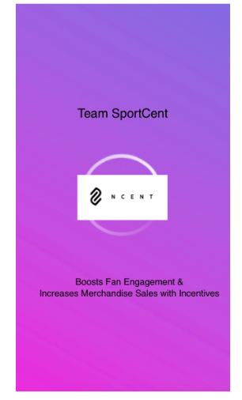
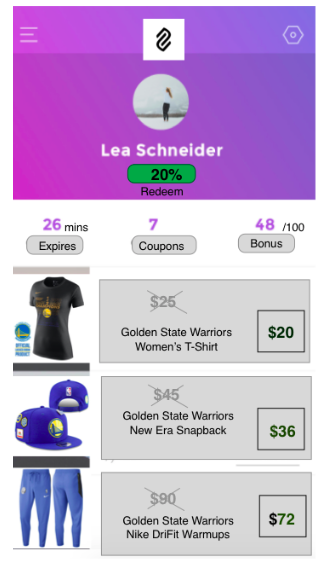
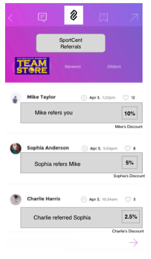
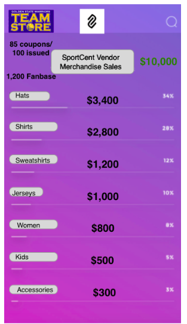

# sportcent1

Developed by 10KD, UX design by Tim Ryan.

## sportCent uses incentives to increase fan engagement and merchandise sales.

How it works: 
- A vendor stamps sportCents for their product and gives them out to users.
- The user can then redeem the sportCent while purchasing a product for a 20% discount. 
- If the user isn't interested in any products, they can give the sportCent to another user before it expires.
- When finally the sportCent is redeemed, discounts coupons will be given recursively to the user and referrers.

### View your discount and eligible products

### View the incentive chain and the respective rewards for your referrers

### For vendors: keep track of sales from sportCent redemptions 
